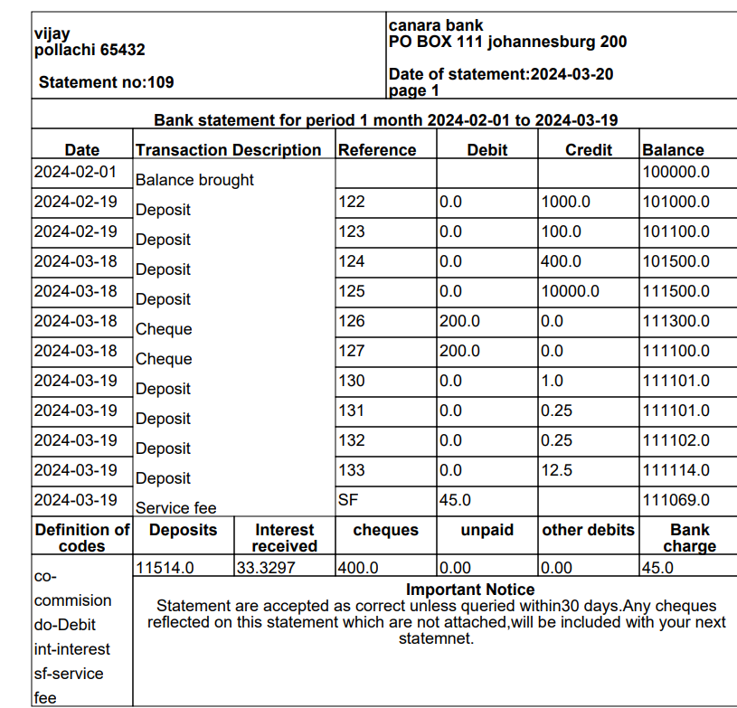

# Bank Transaction System

## Overview

The Bank Transaction System is a user-friendly application designed to manage banking transactions efficiently for both customers and managers. It offers a range of features including account management, transaction processing, statement generation, nominee management, balance inquiry, and more. With role-based access control, customers and managers can securely perform their respective tasks while ensuring data privacy and security.

### Key Features

- **Roles**: Supports two roles - Manager and Customer - each with specific permissions and functionalities.
- **Account Management**: Create, update, and remove customer accounts.
- **Interest Calculating**: Calculate interest based on flag.
- **Email Sending**: Sending mail if Aadhar number not linked.
- **Login Details**: Show the customer login time and account id.
- **Statement Format in PDF Generation**: Generate detailed transaction statements for customers to review their account activity.
- **Nominee Management**: Manage nominee details for customer accounts, providing beneficiaries for financial assets.
- **Transaction Processing**: Deposit, withdraw, and transfer funds between accounts seamlessly.
- **Validation**: Validate the name, email, mobile number, Date of Birth, Aadhar number, credit card, debit card number.

## Functionality Overview

### Manager Role

- **Account Management**: Create, update, and remove customer accounts as needed.
- **Transaction Monitoring**: View transaction logs for monthly statement generation and monitor account activity for security purposes.
- **Statement Generation**: Generate transaction statements as PDF for customers upon request.
- **List Customers**: List the customers added for the given time.
- **Email**: Send email if Aadhar details are not linked with their account.
- **Login History**: Show a list of customers login.
- **System Administration**: Configure system settings and manage user roles and permissions.

### Customer Role

- **Balance Inquiry**: Check account balances.
- **Transaction Processing**: Deposit funds, withdraw cash, and transfer money between accounts securely.
- **Nominee Management**: Add, edit, or remove nominee details to ensure proper asset allocation.
- **Secure Authentication**: Log in securely using unique credentials to access account information and perform transactions.

### How to Access

- Managers can access the system using their designated login credentials provided during setup.
- Customers can log in using their unique username and password to access their accounts and perform banking transactions.

## Installation

### System Setup

1. Install Eclipse.
2. Install MySQL Workbench.

### Database Configuration
```java
Class.forName("com.mysql.cj.jdbc.Driver");
String url="jdbc:mysql://localhost:3306/banktransaction";
conn= DriverManager.getConnection(url,"root","root");
```
### Structure of database
BankTransaction Database Structure:

Tables:
- Manager
  - manager_id: INT (Primary key, auto-increment)
  - username: VARCHAR(50) (Unique username for login)
  - password: VARCHAR(50) (Encrypted password)
  - email: VARCHAR(100) (Email address of the manager)
  - full_name: VARCHAR(100) (Full name of the manager)

- Customer
  - customer_id: INT (Primary key, auto-increment)
  - username: VARCHAR(50) (Unique username for login)
  - password: VARCHAR(50) (Encrypted password)
  - email: VARCHAR(100) (Email address of the customer)
  - full_name: VARCHAR(100) (Full name of the customer)
  - date_of_birth: DATE (Date of birth of the customer)
  - mobile_number: VARCHAR(15) (Mobile number of the customer)
  - aadhar_number: VARCHAR(20) (Aadhar number of the customer)
  - address: VARCHAR(255) (Address of the customer)
  - created_at: TIMESTAMP (Timestamp of account creation)

- Account
  - account_id: INT (Primary key, auto-increment)
  - customer_id: INT (Foreign key to Customer table)
  - balance: DECIMAL(10,2) (Current balance of the account)
  - account_type: VARCHAR(50) (Type of account e.g., savings, current)
  - branch_id: INT (Foreign key to Branch table)
  - created_at: TIMESTAMP (Timestamp of account creation)

- Transaction
  - transaction_id: INT (Primary key, auto-increment)
  - account_id: INT (Foreign key to Account table)
  - amount: DECIMAL(10,2) (Amount of the transaction)
  - transaction_type: VARCHAR(50) (Type of transaction e.g., deposit, withdrawal, transfer)
  - transaction_date: TIMESTAMP (Timestamp of the transaction)
  - remarks: VARCHAR(255) (Remarks or description of the transaction)

- LoginDetails
  - login_id: INT (Primary key, auto-increment)
  - user_id: INT (Foreign key to Manager or Customer table)
  - login_time: TIMESTAMP (Timestamp of login)
  - ip_address: VARCHAR(50) (IP address from which login occurred)

- Nominee
  - nominee_id: INT (Primary key, auto-increment)
  - account_id: INT (Foreign key to Account table)
  - full_name: VARCHAR(100) (Full name of the nominee)
  - relationship: VARCHAR(50) (Relationship with the account holder)
  - address: VARCHAR(255) (Address of the nominee)
  - mobile_number: VARCHAR(15) (Mobile number of the nominee)

- Statement
  - statement_id: INT (Primary key, auto-increment)
  - account_id: INT (Foreign key to Account table)
  - statement_date: DATE (Date of the statement generation)
  - pdf_location: VARCHAR(255) (Location of the generated PDF file)

- Branch
  - branch_id: INT (Primary key, auto-increment)
  - branch_name: VARCHAR(100) (Name of the branch)
  - address: VARCHAR(255) (Address of the branch)
  - contact_number: VARCHAR(15) (Contact number of the branch)

### User Access Setup
- Run the BankTransactionMain.java
### Manager login

- Manager can access the functionalities of Bank Transactions.
- Key Functionalities include:
  - Viewing and editing customer details in the `BankTransaction` database.
  - Generating pdf statement for transaction for specific customer.
  - Send email if Aadhar details not updated with bank account.
  - List the customer login details.
  - List the customer added for given time.
  - Access to all databases, including `Customer`, `Account`, and `Transaction`.
### Customer login

- Customer can access the transaction like deposit,withdrawal.
- Key functionalities include:
   - check balance
   - Add,edit,remove nominee details
   - Deposit amount
   - Withdrawal amount
### PDF generation

- Monthly statement in the form of pdf 
# Conclusion
The Bank Transaction System offers a comprehensive solution for managing banking operations efficiently and securely. With intuitive user interfaces and robust security measures, both customers and managers can conduct transactions with confidence while enjoying a seamless banking experience.

